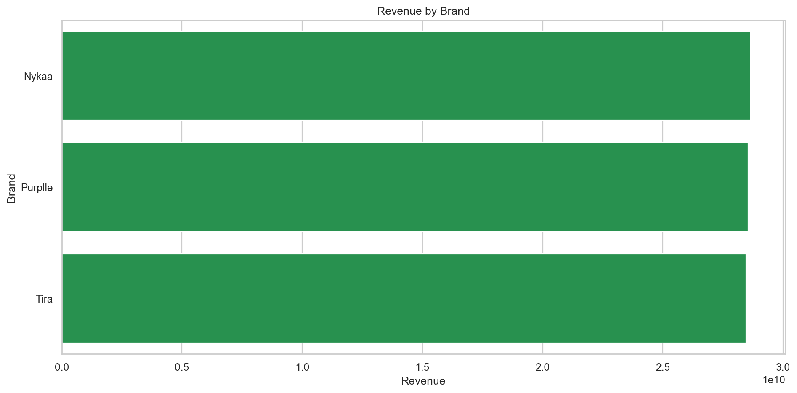
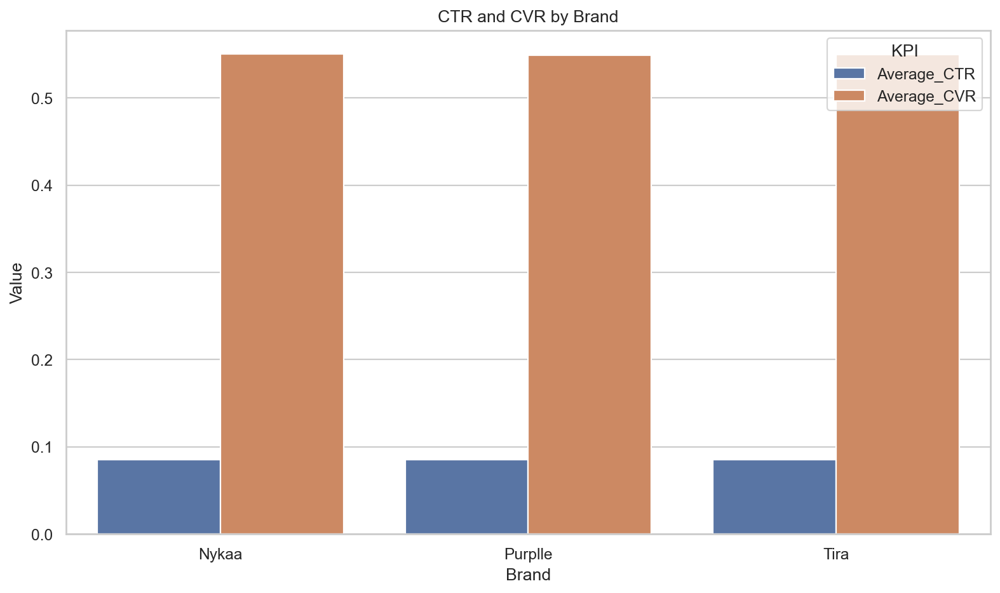
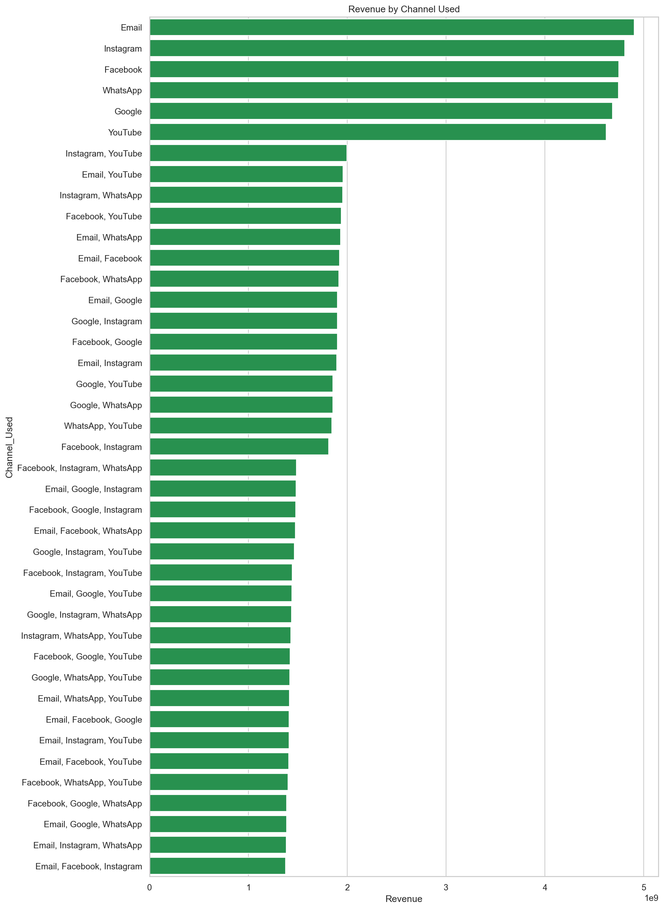
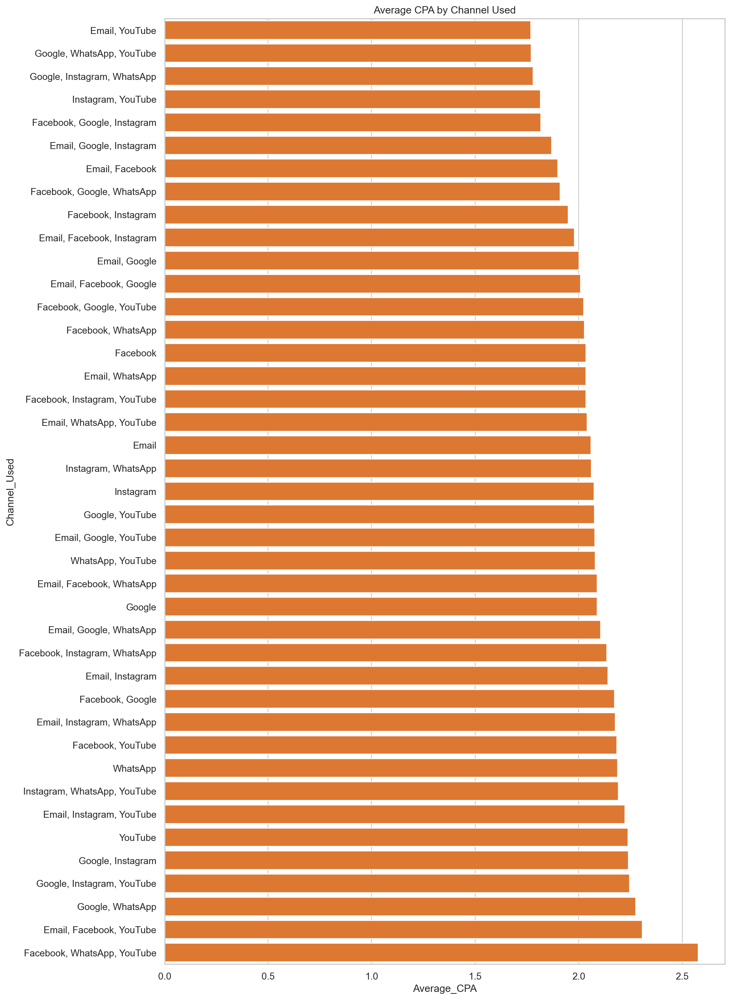
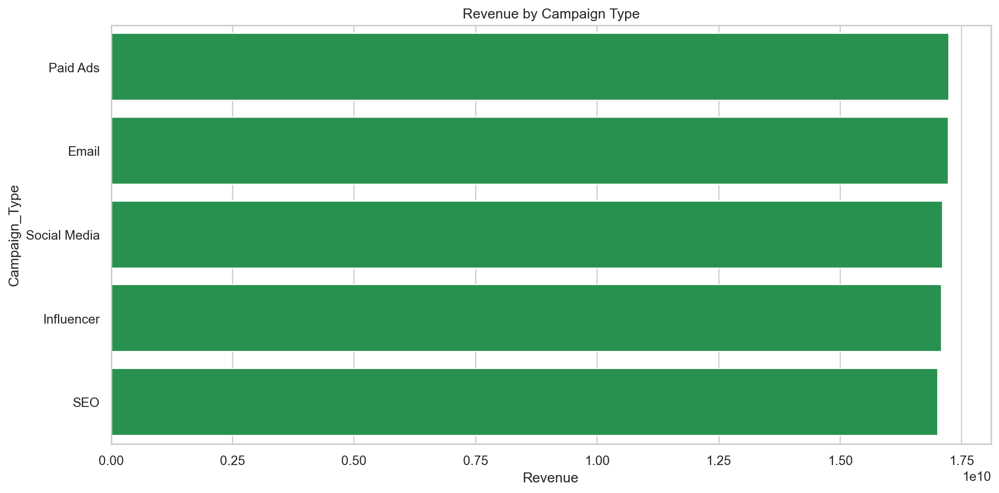
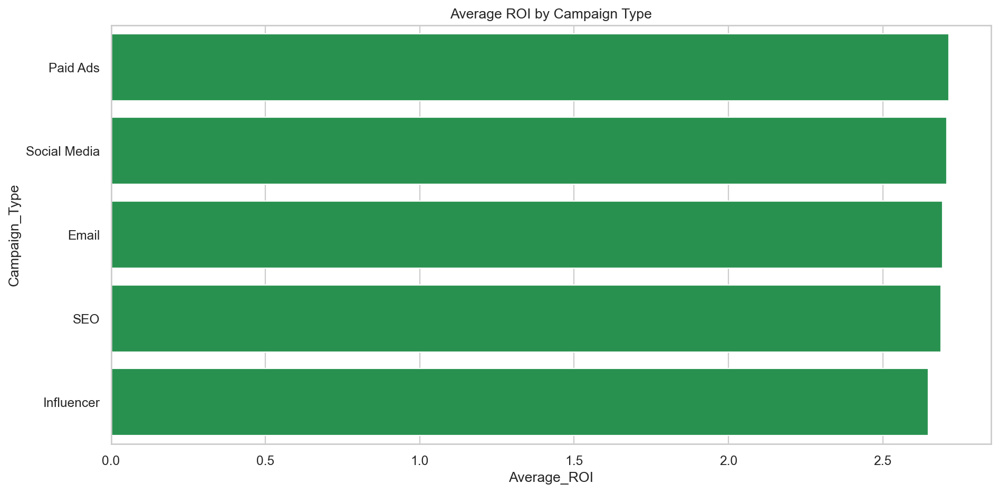
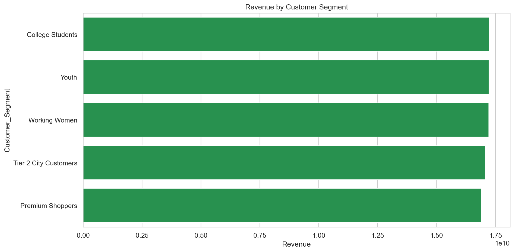
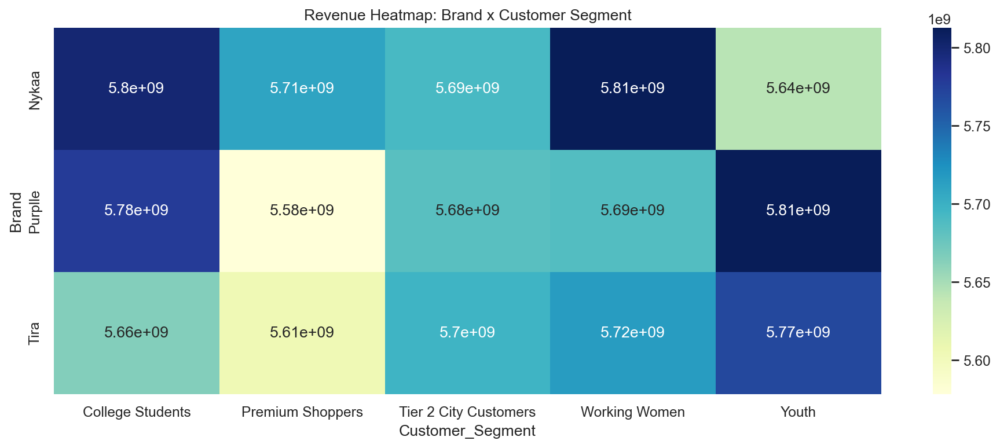
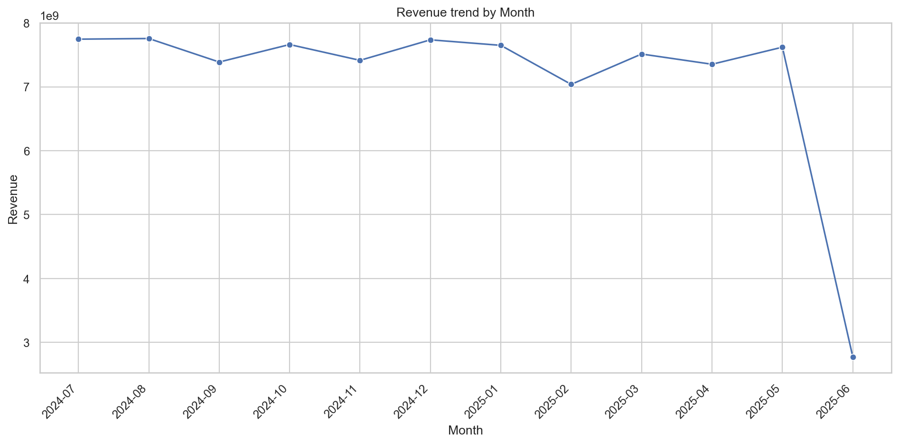
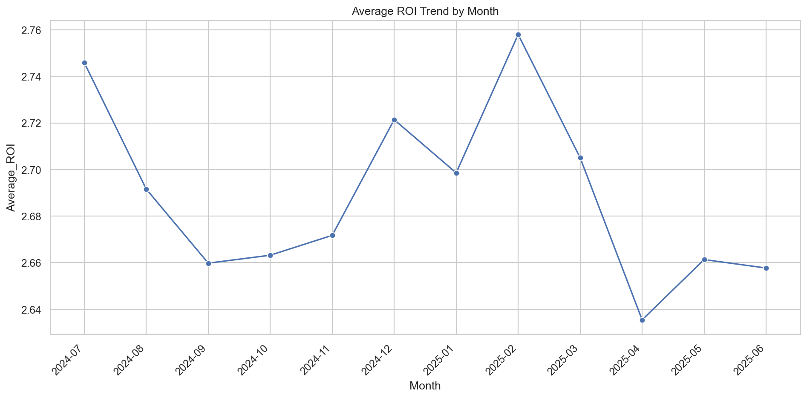

# Multi-Brand Marketing Campaign Performance Analysis

## 1. Project Overview

Phân tích hiệu quả chiến dịch marketing của Nykaa, Purplle và Tira nhằm đánh giá hiệu suất theo brand, channel, campaign type, customer segment và thời gian. Đây là bài toán Data Analysis / EDA / Business Analytics; chưa sử dụng Machine Learning.

## 2. Dataset Overview

- Số chiến dịch: **166,665**
- Số brand: **3**
- Khoảng thời gian: **2024-07-01 đến 2025-06-24**
- Dữ liệu sau cleaning và feature engineering không có missing values.
- Lưu ý: tháng 06/2025 chỉ có dữ liệu đến ngày 24/06/2025.

## 3. Key KPI Summary

| KPI | Giá trị |
|---|---:|
| Total Revenue | 85,650,246,071 |
| Average ROI | 2.691 |
| Total Acquisition Cost | 62,681,853 |
| Average CTR | 8.50% |
| Average CVR | 54.96% |
| Average CPA | 2.076 |
| Total Campaigns | 166,665 |
| Revenue per Click | 109.640 |

## 4. Brand Performance Analysis

- **Nykaa** có tổng Revenue cao nhất: **28,656,364,282**.
- **Nykaa** có Average ROI cao nhất: **2.714**.
- **Tira** có Average CPA thấp nhất: **2.032**.
- Khoảng cách hiệu suất giữa ba brand tương đối nhỏ; Nykaa dẫn đầu nhưng chưa vượt trội tuyệt đối.

## 5. Channel Performance Analysis

- **Email** tạo tổng Revenue cao nhất: **4,903,318,280**.
- **Email, Google, Instagram** có Average ROI cao nhất: **2.866**.
- **Email, YouTube** có Average CPA thấp nhất: **1.769**.
- Nên đánh giá đồng thời ROI, CPA và quy mô campaign; channel có ROI cao nhưng volume thấp chưa chắc phù hợp để scale ngay.

## 6. Campaign Type Analysis

- **Paid Ads** tạo Revenue cao nhất: **17,238,518,867**.
- **Paid Ads** có Average ROI cao nhất: **2.715**.
- **Paid Ads** có Average CPA thấp nhất: **2.024**.
- Paid Ads đang có tổ hợp Revenue, ROI và CPA tốt, phù hợp để thử nghiệm tăng ngân sách có kiểm soát.

## 7. Customer Segment Analysis

- **College Students** tạo Revenue cao nhất: **17,243,247,161**.
- **Working Women** có Average ROI cao nhất: **2.711**.
- **Youth** có Average CVR cao nhất: **55.07%**.

## 8. Monthly Trend Analysis

- Tháng có Revenue cao nhất là **2024-08** với **7,755,913,972**.
- Tháng có Average ROI cao nhất là **2025-02** với ROI **2.758**.
- Revenue và campaign count nhìn chung ổn định giữa các tháng đầy đủ.
- Không nên kết luận Revenue giảm mạnh trong 06/2025 vì tháng này chưa đủ dữ liệu.

## 9. Key Insights

1. Nykaa dẫn đầu cả Total Revenue và Average ROI, nhưng mức chênh lệch so với Purplle và Tira khá nhỏ.
2. Email tạo Revenue tổng cao nhất, trong khi tổ hợp channel có thể đạt ROI hoặc CPA tốt hơn ở quy mô campaign thấp hơn.
3. Paid Ads là campaign type đáng chú ý nhất nhờ Revenue và ROI cao, đồng thời CPA thấp nhất.
4. College Students tạo Revenue cao nhất; Working Women có ROI tốt; Youth có CVR tốt nhất.
5. Revenue theo tháng tương đối ổn định. Dữ liệu tháng 06/2025 là dữ liệu tháng chưa hoàn chỉnh.
6. Acquisition Cost cao không tự động đảm bảo Revenue cao; cần tối ưu theo ROI và CPA thay vì chỉ tăng ngân sách.

## 10. Business Recommendations

1. Tăng ngân sách thử nghiệm cho Nykaa và Paid Ads theo từng đợt nhỏ, theo dõi ROI và CPA trước khi scale lớn.
2. Duy trì Email để bảo vệ quy mô Revenue; đồng thời thử nghiệm các channel combination có ROI cao và CPA thấp.
3. Ưu tiên College Students cho mục tiêu Revenue, Working Women cho mục tiêu ROI và Youth cho mục tiêu conversion.
4. Thiết lập dashboard theo tháng cho Revenue, ROI, CPA, CTR và CVR; không đánh giá tháng chưa hoàn chỉnh như tháng đầy đủ.
5. Rà soát các campaign có Acquisition Cost cao nhưng Revenue thấp để điều chỉnh targeting, creative hoặc ngân sách.

## Caveats

- Phân tích hiện tại là mô tả, không chứng minh quan hệ nhân quả.
- Các nhóm có số lượng campaign khác nhau; cần xem xét volume trước khi scale.
- Chênh lệch KPI nhỏ cần được kiểm định thêm bằng A/B testing hoặc statistical testing.
