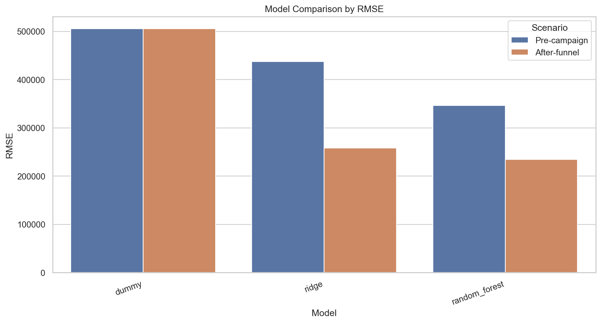
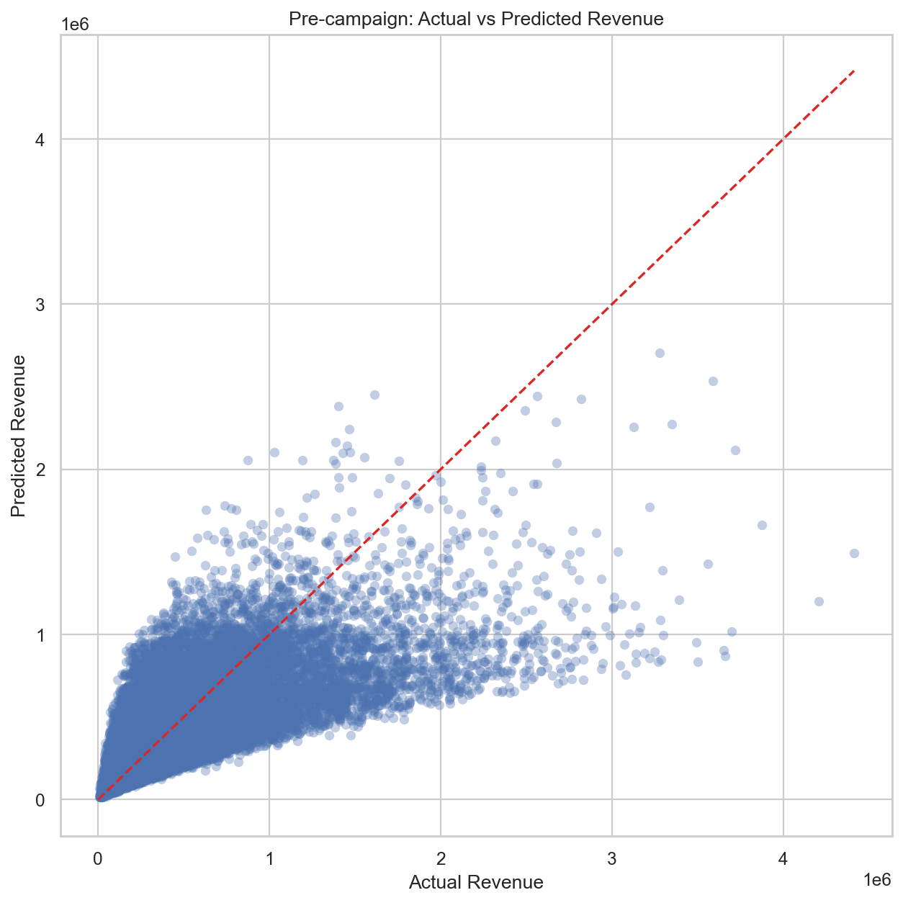
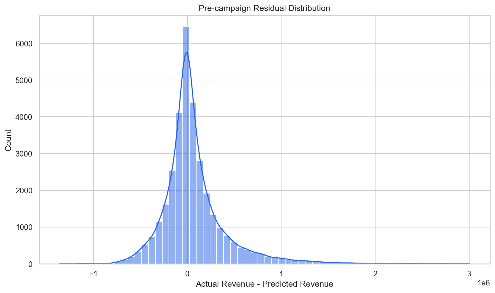
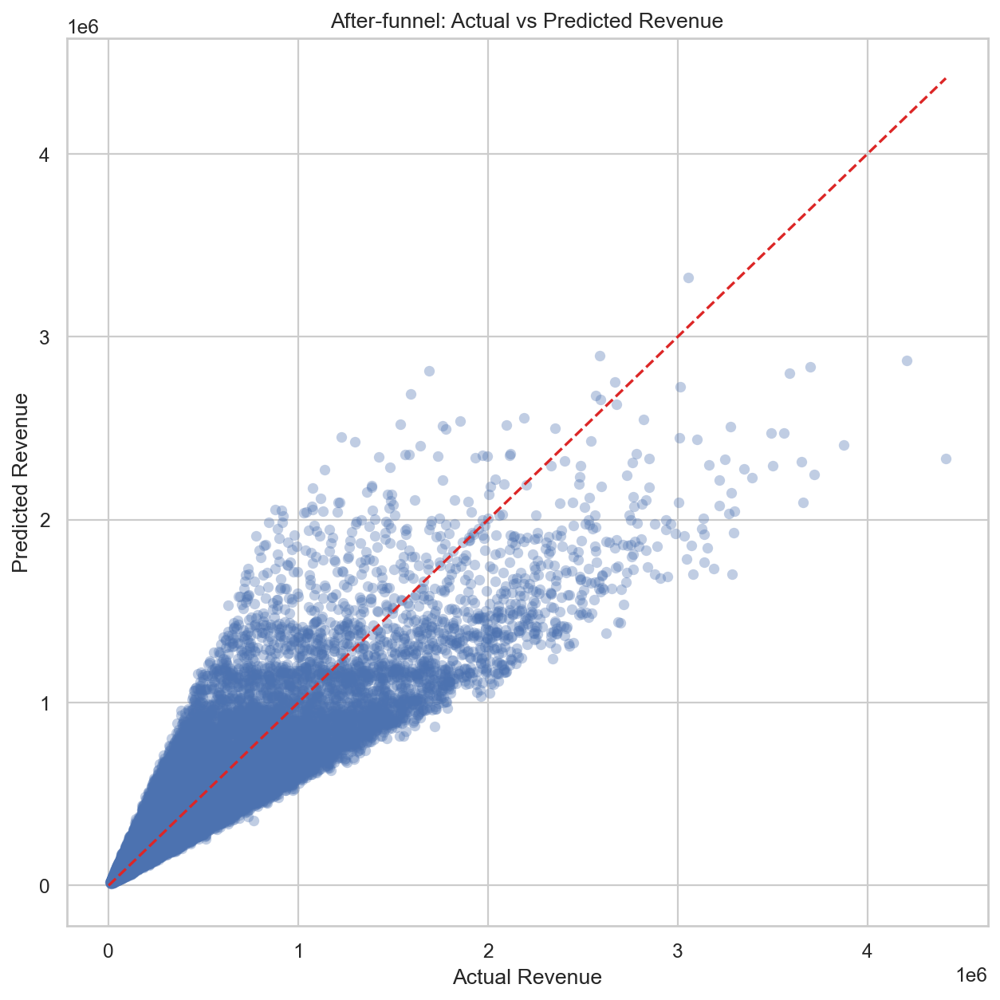
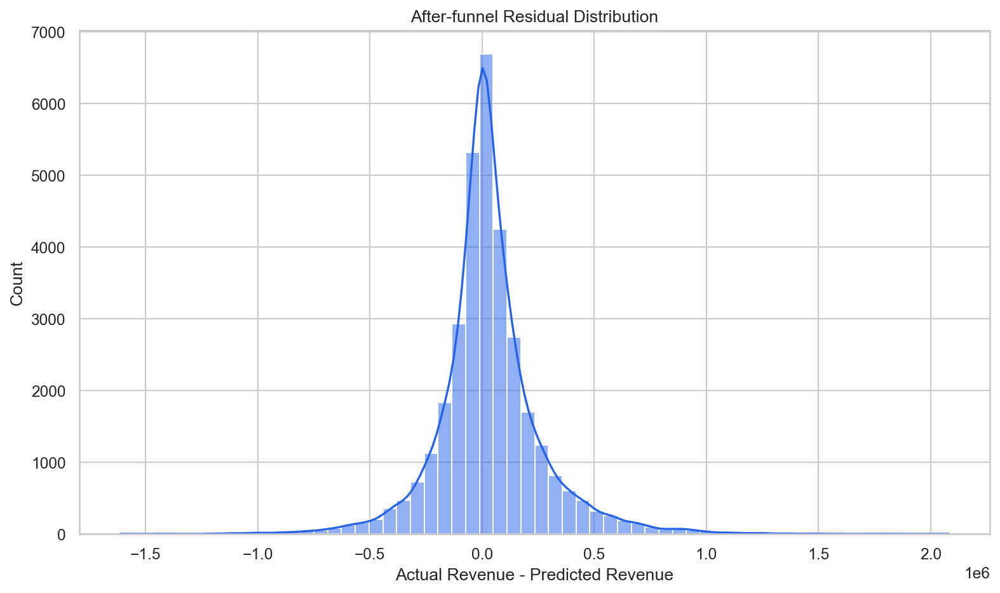

# Revenue Prediction for Marketing Campaigns

## 1. Project Overview

Đề tài này mở rộng project Multi-Brand Marketing Campaign Performance Analysis sang Machine Learning để dự đoán Revenue của campaign. Pipeline ML được tách riêng và không thay đổi logic EDA / Business Analytics hiện tại.

## 2. ML Problem Definition

- Bài toán: Regression.
- Target: `Revenue`.
- Mục tiêu: dự đoán doanh thu campaign và so sánh hai bối cảnh dự đoán.

## 3. Dataset and Target

- Dataset: `data/processed/marketing_campaigns_features.csv`.
- Số dòng: **166,665**.
- Số cột: **28**.
- Target được train bằng `log1p(Revenue)` và đổi ngược bằng `expm1()` khi evaluate/predict.

## 4. Feature Sets

### Pre-campaign

Feature dùng trước khi campaign chạy:

```text
Brand, Campaign_Type, Target_Audience, Duration, Channel_Used, Acquisition_Cost, Language, Customer_Segment, Month, Quarter
```

### After-funnel

Feature late-stage, chỉ dùng khi đã có funnel metrics:

```text
Brand, Campaign_Type, Target_Audience, Duration, Channel_Used, Acquisition_Cost, Language, Customer_Segment, Month, Quarter, Impressions, Clicks, Leads, Conversions, CTR, Lead_Rate, Conversion_Rate, Cost_per_Conversion
```

## 5. Leakage Prevention

Các cột bị loại khỏi cả hai scenario:

```text
Revenue, ROI, Revenue_per_Conversion, Revenue_per_Click
```

Pre-campaign model không dùng Impressions, Clicks, Leads, Conversions hoặc KPI sinh từ funnel. After-funnel model phải được hiểu là late-stage prediction, không phải dự đoán trước campaign.

## 6. Train/Test Split Strategy

- Pre-campaign split: **temporal**.
- After-funnel split: **temporal**.
- Nếu có Date, dữ liệu được tách theo thời gian: 80% đầu làm train, 20% cuối làm test.

## 7. Model Comparison

### Pre-campaign

| Model | MAE | RMSE | R2 | MAPE |
|---|---:|---:|---:|---:|
| dummy | 324,814.1840 | 505,530.2406 | -0.1258 | 116.6566% |
| ridge | 260,416.0298 | 437,541.6960 | 0.1566 | 67.9326% |
| random_forest | 219,004.0533 | 346,492.2498 | 0.4711 | 54.1631% |

### After-funnel

| Model | MAE | RMSE | R2 | MAPE |
|---|---:|---:|---:|---:|
| dummy | 324,814.1840 | 505,530.2406 | -0.1258 | 116.6566% |
| ridge | 165,584.9654 | 257,859.0045 | 0.7071 | 38.6765% |
| random_forest | 155,403.2365 | 234,448.8446 | 0.7579 | 35.5921% |



## 8. Best Model for Pre-campaign

- Best model: **random_forest**.
- RMSE: **346,492.2498**.
- MAE: **219,004.0533**.
- R2: **0.4711**.
- MAPE: **54.1631%**.





## 9. Best Model for After-funnel

- Best model: **random_forest**.
- RMSE: **234,448.8446**.
- MAE: **155,403.2365**.
- R2: **0.7579**.
- MAPE: **35.5921%**.





## 10. Interpretation

Pre-campaign model phù hợp để ước lượng Revenue ở giai đoạn lập kế hoạch vì chỉ dùng thông tin biết trước. After-funnel model thường có nhiều tín hiệu hơn vì đã biết funnel metrics, nên cần diễn giải là dự đoán late-stage.

## 11. Limitations

- Kết quả phụ thuộc vào dữ liệu lịch sử và không chứng minh quan hệ nhân quả.
- Pre-campaign model không thấy hành vi thực tế sau launch nên độ chính xác thường thấp hơn.
- After-funnel model không nên dùng cho quyết định ngân sách trước campaign.
- Nếu dataset thay đổi schema, cần kiểm tra lại feature set và leakage rules.

## 12. How to Use in Streamlit Dashboard

Train model trước:

```bash
venv/bin/python src/train_revenue_prediction.py
```

Chạy dashboard:

```bash
venv/bin/python -m streamlit run app/streamlit_app.py
```

Mở tab **Revenue Prediction ML**, chọn scenario, nhập feature và bấm Predict Revenue.
